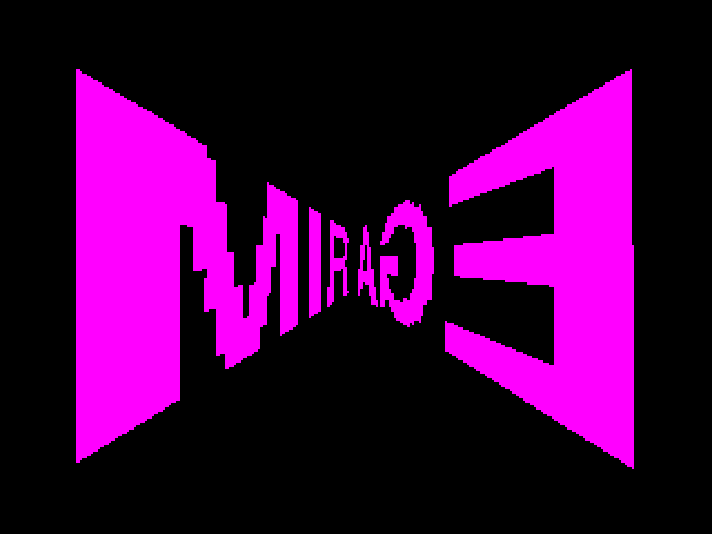
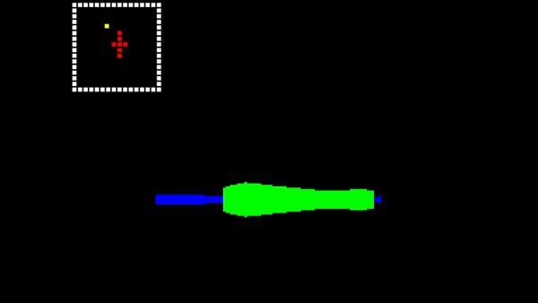

# MIRAGE  (WIP)

A "3-bit" raytracer written in C for professor Milan Vidaković's [FPGA Computer](https://github.com/milanvidakovic/FPGAComputer32) as my bachelor's thesis project.  
  
## Table of Contents
- [Setup](#setup)
- [Features](#features)

## Setup
Use provided makefile along with emulator to build the program.

## Features

- DDA raytracing
- Full fixed point (no floats)
- Custom per-pixel drawing
- Custom line drawing ([Bresenham's](https://en.wikipedia.org/wiki/Bresenham%27s_line_algorithm) and [EFLA-C](http://www.edepot.com/algorithm.html))
- Custom rectangle drwaing
- Fixed point trig functions with LUT equivalents
- Double buffering